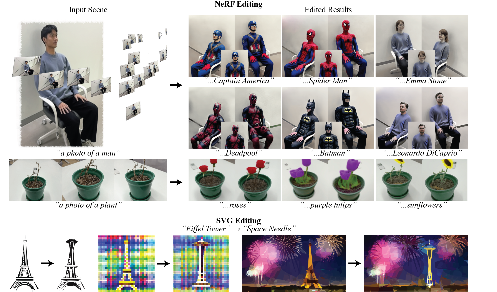

# Posterior Distillation Sampling


[**arXiv**](https://arxiv.org/abs/2311.13831) | [**Project Page**](https://posterior-distillation-sampling.github.io/) <br>

[Juil Koo](https://63days.github.io), [Chanho Park](https://charlieppark.kr/), [Minhyuk Sung](https://mhsung.github.io/) <br>

# Introduction
This repository contains the official implementation of **Posterior Distillation Sampling (PDS)**. <br>
PDS enables various parametric image editing, including NeRF editing and SVG editing. More results can be viewed on our [project webpage](https://posterior-distillation-sampling.github.io/).

# UPDATES
- [x] PDS core code.
- [x] NeRF editing code based on [nerfstudio](https://docs.nerf.studio/).
- [ ] SVG editing code.

[//]: # (### Abstract)
> We introduce Posterior Distillation Sampling (PDS), a novel optimization method for parametric image editing based on diffusion models. Existing optimization-based methods, which leverage the powerful 2D prior of diffusion models to handle various parametric images, have mainly focused on generation. Unlike generation, editing requires a balance between conforming to the target attribute and preserving the identity of the source content. Recent 2D image editing methods have achieved this balance by leveraging the stochastic latent encoded in the generative process of diffusion models. To extend the editing capabilities of diffusion models shown in pixel space to parameter space, we reformulate the 2D image editing method into an optimization form named PDS. PDS matches the stochastic latents of the source and the target, enabling the sampling of targets in diverse parameter spaces that align with a desired attribute while maintaining the source's identity. We demonstrate that this optimization resembles running a generative process with the target attribute, but aligning this process with the trajectory of the source's generative process. Extensive editing results in Neural Radiance Fields and Scalable Vector Graphics representations demonstrate that PDS is capable of sampling targets to fulfill the aforementioned balance across various parameter spaces.

# Get Started

## Construct a Conda Environment

Before running NeRF editing and SVG editing, build a conda environment and install `pds` library:
```
git clone https://github.com/KAIST-Geometric-AI-Group/PDS
cd PDS
conda env create -f environment.yaml
conda activate pds
pip install -e .
```

## NeRF Editing

### Installation
Our NeRF editing code is based on [nerfstudio](https://docs.nerf.studio/).

We have tested our code with torch 2.0.1+cu118, nerfstudio 0.3.4, diffusers 0.17.1 and transformers 4.30.2.

Install `pds_nerf` library:
```
cd PDS/pds/nerf
pip install -e .
```

You should be able to see `pds` and `pds_refinement` options in the following command:
```
ns-train -h
```

### Finetuning Stable Diffusion with Dreambooth
For NeRF editing, we have found that finetuning Stable Diffusion using [Dreambooth](https://dreambooth.github.io/) effectively reduces discrepancies between input prompts and real image data.

Under the directory `PDS/pds/dreambooth`, you can finetune a pre-trained stable diffusion model with Dreambooth by:
```
python run.py --instance_prompt {"PROMPT_WITH_SPECIAL_TOKEN"} --instance_dir {PATH/TO/DATA_DIR} --class_prompt {"PROMPT_WITHOUT_SPECIAL_TOKEN"} --save_dir {PATH/TO/SAVE_DIR} 
```

An instance prompt describes input images with a special token, for example, "a photo of a sks man", whereas a class prompt is a more general description for generated sample images, such as "a photo of a man", without a special token.

Please refer to the [Dreambooth](https://dreambooth.github.io/) paper or diffuser's [document](https://huggingface.co/docs/diffusers/training/dreambooth) for more details.

### Downloading Image Data and Finetuned Dreambooth Checkpoint
We provide image data and our finetuned Dreambooth checkpoints [here](https://kaistackr-my.sharepoint.com/:f:/g/personal/63days_kaist_ac_kr/EocMB6MBpMJJksILj5_C7TYBsU5MCtKS7Wi8FCjlncLnug?e=TTUJZc).

Below are the instance prompts we used in Dreambooth finetuning:

- person-small: "a photo of a sks man"
- yuseung: "a photo of a sks man"

### Run
#### 1. Initialize NeRF
To edit a NeRF scene with PDS, first initiailize a NeRF with Nerfacto:
```
ns-train nerfacto --data {DATA_DIR} --pipeline.model.use_appearance_embedding False
```
Set `pipeline.model.use_appearance_embedding=False`. We have found that not using appearance embedding leads to better editing results, reducing artifacts.

#### 2. Edit NeRF by PDS
Then, now edit the NeRF scene by PDS:
```
ns-train pds --data {DATA_DIR} --load-dir {PATH/TO/NERFACTO_OUTPUT_DIR/nerfstudio_models} \\
		--pipeline.pds.src_prompt {"DESCRIPTION_FOR_ORIGINAL_SCENE"} \\
		--pipeline.pds.tgt_prompt {"DESCRIPTION_FOR_TARGET_SCENE"} \\
		--pipeline.pds.sd_pretrained_model_or_path {PATH/TO/DREAMBOOTH_SAVE_DIR}
```
Here, {DATA\_DIR} should be the same as {DATA\_DIR} used in Nerfacto training. If you use a dreambooth finetuned model as a prior, don't forget to include a special token in both `src_prompt` and `tgt_prompt`.

For instance, you can try editing with our finetuned dreambooth model as follows:
```
ns-train pds --data {.../data/yuseung} --load-dir {PATH/TO/NERFACTO_OUTPUT_DIR/nerfstudio_models} \\
		--pipeline.pds.src_prompt "a photo of a sks man" \\
		--pipeline.pds.tgt_prompt "a photo of a sks Spider Man" \\
		--pipeline.pds.sd_pretrained_model_or_path {.../dreambooth_ckpt/yuseung_dreambooth}
```

After the training, it will automatically render an edited NeRF scene at the same viewpoints of a training dataset and save those rendering images under `PATH/TO/OUTPUT_DIR/eval_outputs`.

#### 3. Refine NeRF by SDEdit
Our full NeRF editing pipeline inlcudes a refinement stage. In the refinement stage, the renderings of an edited NeRF by PDS are updated by [SDEdit](https://sde-image-editing.github.io/) and the NeRF scene is reconstructed with these iteratively updated images.

```
ns-train pds_refinement --data {PATH/TO/PDS_OUTPUT_DIR/eval_outputs} --load-dir {PATH/TO/PDS_OUTPUT_DIR/nerfstudio_models} --pipeline.pds.tgt_prompt {"DESCRIPTIOIN_FOR_TARGET_SCENE"} --pipeline.pds.sd_pretrained_model_or_path {PATH/TO/DREAMBOOTH_SAVE_DIR}
```
Here, `PATH/TO/PDS_OUTPUT_DIR` is the output directory of the previous stage. Pass the same `tgt_prompt` and diffusion model used in the previous stage.

## SVG Editing
Coming soon.

# Citation
If you find our work useful, please consider citing:
```
@article{koo2023pds,
    title={Posterior Distillation Sampling},
    author={Koo, Juil and Park, Chanho and Sung, Minhyuk},
    year={2023},
    journal={arXiv preprint arXiv:2311.13831},
}
```

